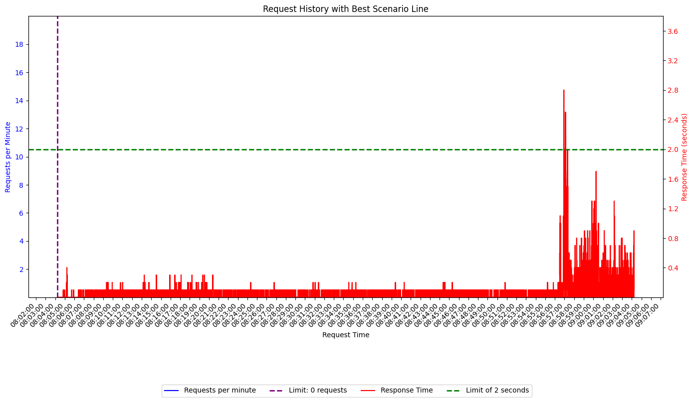

# Performance Testing Project with Locust

This project uses Locust, a Python-based load testing tool, to evaluate the performance of the Swagger Petstore API. The tests were designed to simulate real-world user load and identify potential bottlenecks in the API's performance. This document outlines the project's structure, testing methodology, and key results.

## Project Overview

The main goal of this project is to assess the scalability and stability of the Swagger Petstore API under various load conditions. This was achieved by simulating concurrent users and measuring key performance metrics such as requests per second, response times, and error rates.

## Technologies Used

*   **Python:** The core programming language used for scripting tests.
*   **Locust:** A load testing tool used to simulate concurrent users and generate load on the API.
*   **Swagger Petstore API:** The target API for performance testing.
*  **Faker:** Library used to generate realistic fake data.

## Project Structure

The project is structured as follows:

```plaintext
local-swagger-petstore-locust-performance/
├── performance/
│ ├── create_user_post.py # Python script to test Create User API
│ ├── find_pet_by_id_get.py # Python script to test Find Pet by ID API
│ ├── Data/
│ └── Logs/
```

----------

## Testing Methodology

The testing was conducted through different scenarios to evaluate different aspects of the API:

1.  **Exploratory Testing:** This test was performed to get a baseline performance under a light load with one user, providing a basic understanding of the API's behaviour.
2.  **Load Testing:** This test was carried out by increasing the number of concurrent users to understand how the API performs under a higher load.
3.  **Concurrency Testing:** This test was designed to push the limits of the 'Create User' API to determine its maximum capacity and potential weak points.

## Performance Test Results

### Find Pet by ID API

The following table presents the performance results for the 'Find pet by ID' API:

| Scenario             | Average Requests per Second | Responses Exceeding 2 Seconds | Responses <= 2 Seconds | Request Errors | Error Percentage | Concurrent Users | Test Duration | API             |
|----------------------|----------------------------|-----------------------------|-----------------------|----------------|------------------|------------------|-----------------|-----------------|
| Exploratory Testing  | 1.3                        | 2355                         | 2355                  | 0              | 0%              | 1                | 30 minutes      | Find pet by ID |
| Load Testing (50)   | 30.3                       | 24761                        | 24761                 | 0              | 0%              | 50               | 15 minutes      | Find pet by ID |
| Load Testing (150)  | 91.5                       | 74710                        | 74710                 | 0              | 0%              | 150              | 15 minutes      | Find pet by ID |

**Analysis:**

*   The 'Find pet by ID' API demonstrates excellent performance even under significant load.
*   No errors were recorded in any of the tests, and all responses were received within a reasonable timeframe.
*   The API can handle 150 concurrent users without experiencing any performance degradation, suggesting it's highly scalable.

### Create User API

**Concurrency Testing Results:**

*   During concurrency testing of the 'Create User' API, it was observed that the service does not support 150 concurrent users.
*   Approximately 86% of the requests resulted in errors, including 500 and 404 status codes.
*   The 'Create User' API performs best under 50 concurrent users.

**Analysis:**

*   The 'Create User' API exhibits performance issues under high concurrency, and it's not able to handle the number of requests effectively when 150 concurrent users are simulated.
*   The API performs optimally with 50 concurrent users.

## Key Findings

*   The 'Find pet by ID' API is highly scalable and stable under high load, showing no signs of performance degradation up to 150 concurrent users.
*   The 'Create User' API is not scalable and fails under high concurrency, with 150 concurrent users resulting in significant errors. It performs well with up to 50 concurrent users.
*   These results highlight a need to investigate the 'Create User' API further to understand the root causes of performance bottlenecks.

## Expert Conclusions

Based on the performance test results, it's evident that the Swagger Petstore API has areas of significant strength and areas needing immediate attention. The 'Find pet by ID' API, in its current state, showcases remarkable scalability and stability. The API handled a load of 150 concurrent users flawlessly, indicating it can readily support significant traffic. This is indicative of a well-designed and optimized endpoint that's likely not resource-intensive and is likely well-architected. This is a positive highlight and should serve as a blueprint for other API designs within the service.


On the other hand, the performance of the 'Create User' API reveals a critical vulnerability. The inability to handle 150 concurrent users with an 86% failure rate of requests points to a serious architectural or resource bottleneck. The observed error codes (500 and 404) further suggest the problem could stem from resource exhaustion, database contention, or misconfiguration. The fact that the API only performs optimally with 50 concurrent users indicates a clear limit on scalability that cannot be ignored. The failure of this service is critical because user creation is often a core function, and its inability to scale will have immediate negative consequences. This not only leads to poor user experience but can have implications for the stability of the application.




From a testing perspective, these results emphasize the importance of using a mix of performance tests, including load and concurrency tests, to expose varying weaknesses of a system. The test methodology is valid for the purpose of the project but should be extended with more real-world simulations. Moving forward, the development and operations teams should focus on a detailed root cause analysis for the 'Create User' API, possibly including profiling the API under load, scrutinizing its resource requirements, and optimizing database interactions. Ignoring these critical findings could lead to system failure or a poor user experience when the application is used in a live environment.

## Script Descriptions

The performance tests are implemented in Python using Locust. Here's a description of the key files:

### `create_user_post.py`

*   **Purpose**: This script is designed to simulate concurrent users creating new users through the `POST /api/v3/user` endpoint.
*   **Functionality:**
    *   It uses the `Faker` library to generate realistic user data.
    *   It sends POST requests with generated JSON payloads, logging the request date, time, status code, response size, response time, and parameters.
    *   It logs all requests (successful and failed) to a CSV file.
    *   It uses logging to track errors during the execution.
    *   **Execution parameters:**
        *   `locust -f create_user_post.py --users 150 --web-port=8090 --spawn-rate 0 --run-time 60m` (for concurrency test with 150 users)
        *   `locust -f create_user_post.py --users 50 --web-port=8090 --spawn-rate 0 --run-time 30m` (for a more stable test with 50 users)

### `find_pet_by_id_get.py`

*   **Purpose**: This script simulates concurrent users retrieving a pet using the `GET /api/v3/pet/{petId}` endpoint.
*   **Functionality:**
    *   It sends GET requests to the specified endpoint and logs the request date, time, status code, response size, response time and no parameters applied
    *   It logs all requests (successful and failed) to a CSV file.
    *   It uses logging to track any errors during the execution.
     *   **Execution parameters:**
        *   `locust -f find_pet_by_id_get.py --users 1 --web-port=8090 --spawn-rate 1 --run-time 30m` (Exploratory test with 1 user)
        *   `locust -f find_pet_by_id_get.py --users 50 --web-port=8090 --spawn-rate 0.16 --run-time 15m` (Load Test with 50 users)
        *  `locust -f find_pet_by_id_get.py --users 150 --web-port=8090 --spawn-rate 0.5 --run-time 15m` (Load Test with 150 users)
        * `locust -f find_pet_by_id_get.py --users 500 --web-port=8090 --spawn-rate 0.55 --run-time 30m` (Load Test with 500 users)

## Future Enhancements

Future efforts will include:

*   Testing additional API endpoints to provide a comprehensive analysis of overall performance.
*   Automating the testing process to facilitate continuous performance monitoring.
*   Adding more advanced testing scenarios such as ramp-up and ramp-down tests to simulate more real-world user patterns.

## Developed By

This project was developed by [Nicolas Ortiz](https://www.linkedin.com/in/ortiznicolas/).

### Contact Information:
- **LinkedIn**: [https://www.linkedin.com/in/ortiznicolas/](https://www.linkedin.com/in/ortiznicolas/)
- **Email**: vinico0911@hotmail.com
- **Mobile**: +573215105973

## Contributing

Feel free to contribute to the project by creating pull requests, reporting issues, or suggesting improvements.